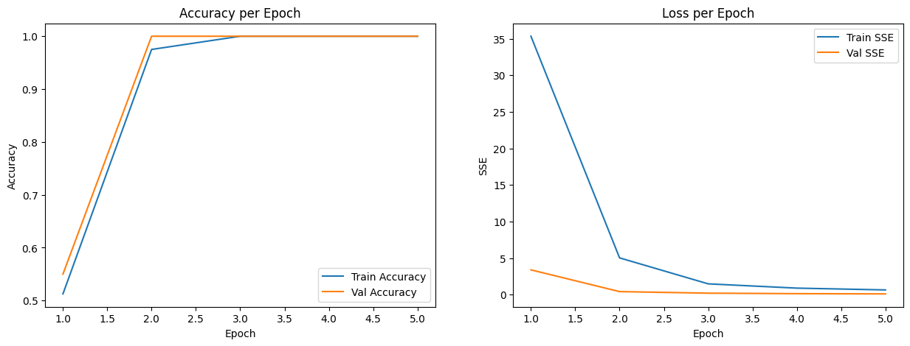

# Single Layer Perceptron of Iris Dataset in Python Notebook

## Summary

- Iris dataset (50 Iris-setosa and 50 Iris-versicolor)
- Binary encoding
- 80:20 Data split
- Sigmoid activation function
- Stochastic gradient descent

## Running the Code

Import data and file and Run in Google Colab

## Result

